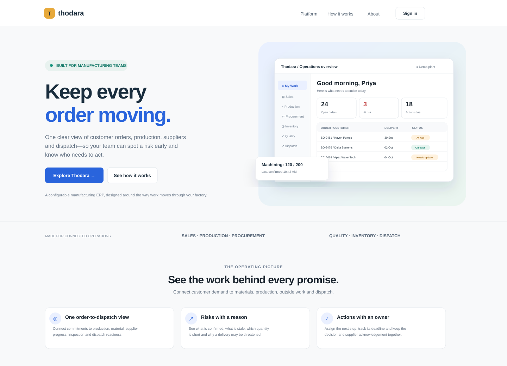
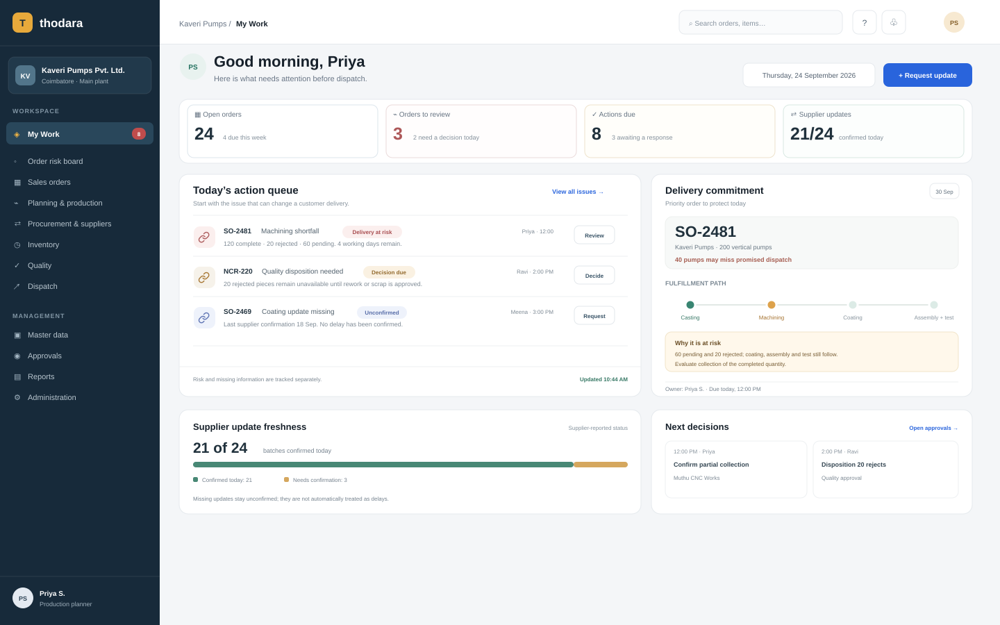
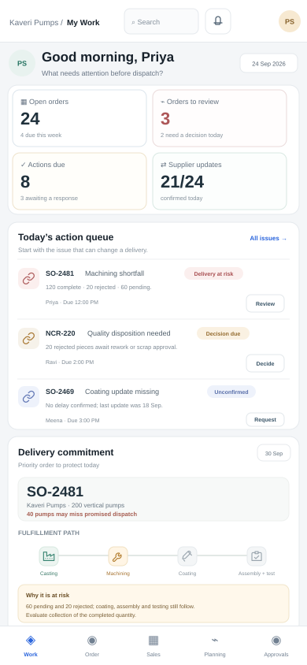

# Thodara design preview

## Product direction

The UI is an operational manufacturing ERP, not a marketing-only dashboard. It is designed to keep daily work legible: a calm neutral canvas, dark navy workspace navigation, blue primary actions, and restrained risk colors. Risk and missing confirmation are different states. Status is always written in text as well as color.

## Pages represented

| Area | Screens in the preview |
|---|---|
| Public | Product landing page, product value blocks, calls to action |
| Identity | Sign in, create workspace, reset password |
| Onboarding | Guided company and plant setup step |
| Work management | My Work action list, order risk board, customer order detail and dependency path |
| Commercial | Sales order list and order fulfillment summary |
| Operations | Production/work order view, outsourced operation updates, supplier list entry point |
| Inventory and quality | Inventory availability, stock traceability, inspection queue and quality hold states |
| Delivery | Dispatch readiness, shipment list and partial shipment state |
| Core configuration | Item/customer/supplier master data, approvals, users/roles, site and tenant administration |
| Insights | Operational reports for delivery, late receipts, status freshness and chasing time |
| External supplier | Responsive batch update form, quantity reconciliation cue and freshness/provenance |
| Scope gate | Finance page explicitly marked as awaiting confirmed accounting/statutory requirements |

## Selected screen renders

### Public landing page

### Daily operations workspace

### Mobile daily operations workspace

The click-through preview contains the rest of the page designs listed above.

## Key interaction flow

1. Open the landing page and choose **Explore Thodara** or **Sign in**.
2. Enter the sample workspace to view the daily action list.
3. Open the risk board or select an order to see its dependency path and risk explanation.
4. Review the supplier update in procurement or switch to **Supplier update view** to see the mobile-first update experience.
5. Use the workspace navigation to inspect each module screen. The mobile navigation keeps core daily pages reachable on smaller screens.

## Fidelity and non-goals

This is a page-design prototype, not an implemented ERP. Data is fictional; page content is illustrative. Forms and actions provide visual feedback but do not persist data. Authentication, tenant isolation, server-side RBAC, quantity validation, approval policy, date calculations, audit records, imports, notifications and integrations must be implemented and tested according to the product plan. The displayed delivery risks are examples, not live promises or validated calculation rules.

## Accessibility and responsive intent

- Use headings in page order, labels for fields and accessible names for icon controls.
- Pair status colors with explicit text labels.
- Keep tables horizontally scrollable on narrow screens.
- Prioritize supplier updates, approvals, receipts and dispatch for mobile use.
- Respect the system text size, keyboard focus and reduced-motion settings in the production design system.
